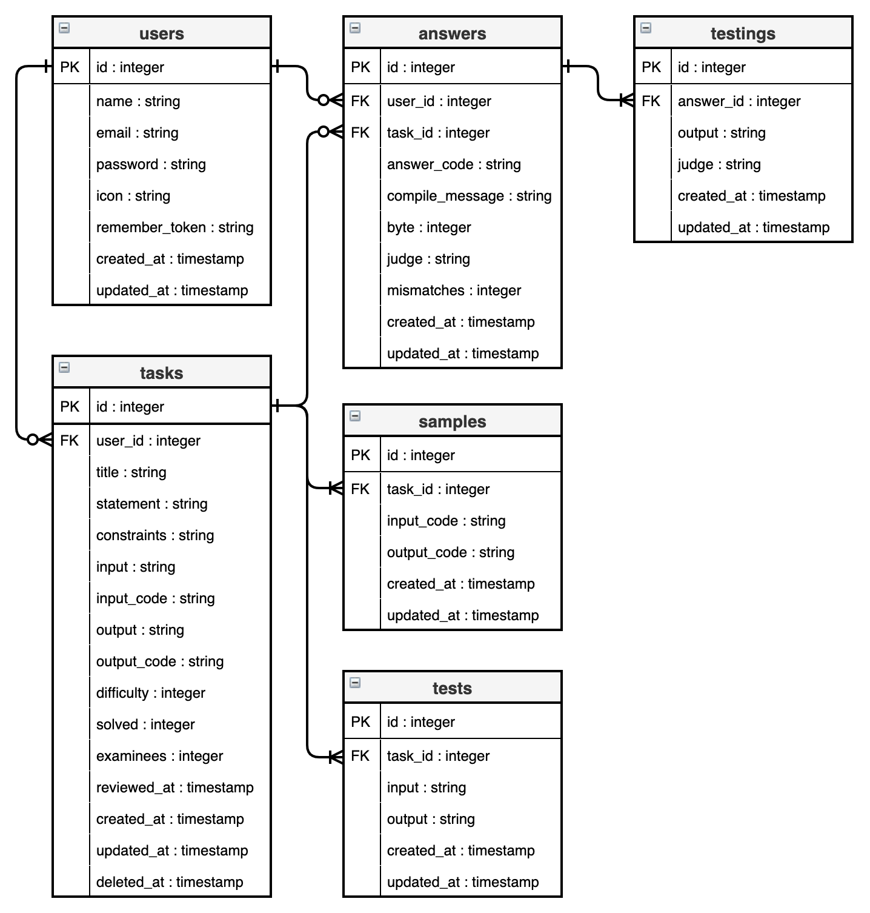

# Pechpa! Ver1.0
PHPでアルゴリズム問題を解く基礎を学べるサービスです。
問題に回答できるだけでなく問題を考えて出題したりすることもできます。
以下のURLで公開中です。
[https://pechpa.com](https://pechpa.com)

## このアプリを作った背景
既存のアルゴリズムを解くサービスは初心者には敷居が高く、
これから競プロ等にチャレンジしようと考えている初心者に
基礎学習・練習の場を提供したかった為です。

私自身が初めて競プロに挑戦した際、
- 学習方法がいまいち分からない
- 基礎的な問題があるサイトを見つけられなかった
- 気軽に解ける問題がなかった
といったことに悩まされました。

これらの背景から**ユーザーが気軽に回答できるサービス**を作りたいと思ったことがきっかけです。

また、アルゴリズム問題を解く上で問題を作成することで
解答時とは異なる視点で問題を見ることができ
高い学習効果が得られるのではないかと考え、
**ユーザーが気軽に問題を提案できる機能**も実装しました。

## 実装した機能一覧
- **ゲストログイン機能**
- **問題回答機能**
- **問題検索機能**
- **問題作成・保存・削除機能**
- **管理者へのメール通知機能**
- **管理者問題承認機能**
- **ユーザープロフィール表示機能**
- **ユーザープロフィール編集機能**

### ゲストログイン機能
- 機能を試したい方のためのゲストログイン機能です。

### 問題回答機能
- 提出されたソースコードに対して下記内容のチェックを実行します。
	- `php -l`コマンドによる文法チェック
	- 問題の各テストケースの結果と合致しているかの検証及び検証結果の保存
	- コード長の測定及び測定結果の保存

### 問題検索機能
- 以下の内容で問題を検索できる機能です。
	- 問題名の曖昧検索
	- 難易度別の絞り込み検索
	- 正答率上限／下限による絞り込み検索
	- 回答者の有無による絞り込み検索

### 問題作成・保存・作成機能
- ユーザーが問題を提案できる機能です。
- 提出された問題は後述のメール通知機能により管理者全員に通知されます。
- 管理者が承認することで正式に公開されます。
- 承認される前であれば作成した問題の編集・削除が行えます。

### 管理者へのメール通知機能
- ユーザーが問題を作成した場合に管理者全員のメールアドレスに通知されます。

### 管理者問題承認機能
- 管理者が作成された問題を確認・編集・承認できる機能です。

### ユーザープロフィール表示機能
- 下記内容を表示させる機能です
	- 登録日時
	- ユーザー名
	- 回答数
	- 正答数
	- 正答率
	- 承認待ち問題数
	- 承認済み問題数
	- 作成した問題一覧（承認済み／承認待ち別）

### ユーザープロフィール編集機能
- プロフィール画像アップロード及びユーザー名編集を行えます。

## ER図

## 開発環境
- サーバー : Linux(CentOS)  8.2.2004
- Webサーバーソフトウェア : Apache 2.4.37
- 言語 : PHP 7.4.12
- フレームワーク : Laravel 5.5.50
- データベース : MySQL 8.0.21

## 使用ツール
- バージョン管理 : Git
- ソースコード管理 : GitHub
- デザイン関連 : Canva, Draw.io

## 製作者
[Taturon](https://twitter.com/_Taturon_)
E-mail : taturon5511@gmail.com
